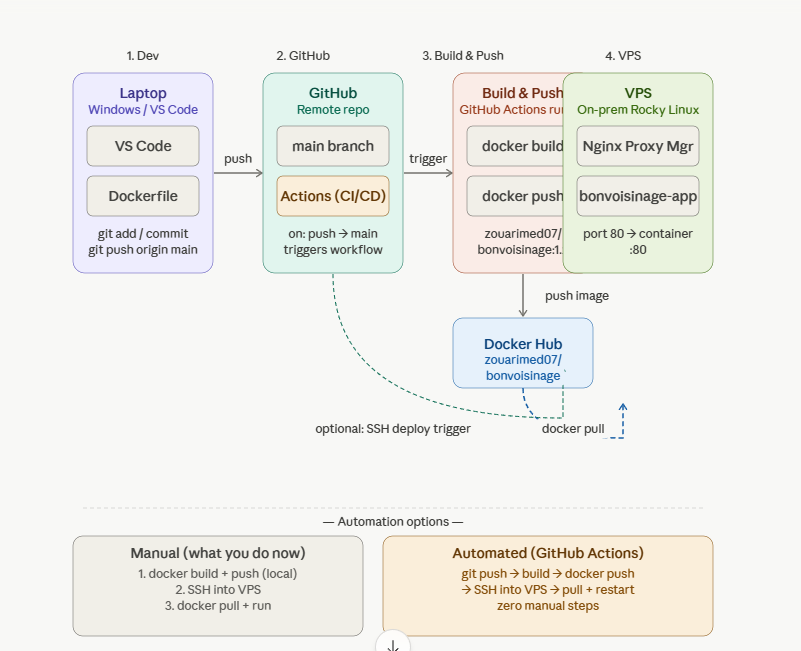

# CI/CD Automation — VS Code → GitHub → Docker Hub → VPS

Full deployment pipeline for **bonvoisinage** web app.  
Every `git push` to `main` automatically builds, pushes, and deploys to the VPS — zero manual steps.

---

## Architecture overview

```
VS Code (Windows)
      │
      │  git push origin main
      ▼
GitHub (med-zouari07/web-app-mz)
      │
      │  GitHub Actions triggered on push → main
      ▼
GitHub Actions Runner
      ├── docker build -t zouarimed07/bonvoisinage:latest .
      └── docker push → Docker Hub
                              │
                              │  SSH into VPS
                              ▼
                        VPS (Rocky Linux)
                              ├── docker pull zouarimed07/bonvoisinage:latest
                              ├── docker stop bonvoisinage-app
                              ├── docker rm bonvoisinage-app
                              └── docker run -d -p 80:80 --name bonvoisinage-app ...
```

---

## Step 1 — Prepare the VPS SSH key

SSH into your VPS and generate a dedicated deploy key:

```bash
ssh-keygen -t ed25519 -C "github-deploy" -f ~/.ssh/github_deploy -N ""
cat ~/.ssh/github_deploy.pub >> ~/.ssh/authorized_keys
chmod 600 ~/.ssh/authorized_keys
chmod 700 ~/.ssh
```

Copy the **private key** — you will need it in Step 2:

```bash
cat ~/.ssh/github_deploy
```


---

## Step 2 — Add secrets to GitHub

Go to your repo → **Settings → Secrets and variables → Actions → Repository secrets**  
Click **New repository secret** and add each one:

| Secret name | Value |
|---|---|
| `DOCKERHUB_USERNAME` | `zouarimed07` |
| `DOCKERHUB_TOKEN` | Docker Hub access token (not your password) |
| `VPS_HOST` | your VPS IP address |
| `VPS_USER` | `rocky` |
| `VPS_SSH_KEY` | full output of `cat ~/.ssh/github_deploy` |

> **Important:** These must be **Repository secrets**, not Environment secrets.  
> To get a Docker Hub token: hub.docker.com → Account Settings → Security → Personal access tokens → New token (Read & Write).

---

## Step 3 — Create the GitHub Actions workflow

In your project root, create the file `.github/workflows/deploy.yml`:

```yaml
name: Build and Deploy

on:
  push:
    branches: [main]

jobs:
  deploy:
    runs-on: ubuntu-latest
    env:
      FORCE_JAVASCRIPT_ACTIONS_TO_NODE24: true

    steps:
      - name: Checkout code
        uses: actions/checkout@v4

      - name: Login to Docker Hub
        uses: docker/login-action@v3
        with:
          username: ${{ secrets.DOCKERHUB_USERNAME }}
          password: ${{ secrets.DOCKERHUB_TOKEN }}

      - name: Build and push image
        uses: docker/build-push-action@v6
        with:
          context: .
          push: true
          tags: zouarimed07/bonvoisinage:latest

      - name: Deploy to VPS via SSH
        uses: appleboy/ssh-action@v1
        with:
          host: ${{ secrets.VPS_HOST }}
          username: ${{ secrets.VPS_USER }}
          key: ${{ secrets.VPS_SSH_KEY }}
          script: |
            docker pull zouarimed07/bonvoisinage:latest
            docker stop bonvoisinage-app || true
            docker rm bonvoisinage-app || true
            docker run -d -p 80:80 --name bonvoisinage-app zouarimed07/bonvoisinage:latest
```

Commit and push this file:

```bash
git add .github/workflows/deploy.yml
git commit -m "add CI/CD pipeline"
git push origin main
```

---

## Step 4 — Verify the pipeline

Go to your repo → **Actions** tab.  
You should see a workflow run triggered automatically. All 5 steps should be green:

```
✅ Checkout code
✅ Login to Docker Hub
✅ Build and push image
✅ Deploy to VPS via SSH
```

On your VPS, confirm the container is running:

```bash
docker ps
```

Expected output:

```
CONTAINER ID   IMAGE                              STATUS         PORTS                NAMES
xxxxxxxxxxxx   zouarimed07/bonvoisinage:latest    Up X seconds   0.0.0.0:80->80/tcp   bonvoisinage-app
```

---

## Daily workflow (after setup)

From now on, all you do is:

```bash
# Make your changes in VS Code, then:
git add .
git commit -m "describe your change"
git push
```

GitHub Actions handles everything else. Deployment takes about 2–3 minutes.

---

## Troubleshooting

### "Username and password required"
- Make sure `DOCKERHUB_TOKEN` is a Docker Hub **access token**, not your account password.
- Regenerate it at hub.docker.com → Account Settings → Security → Personal access tokens.

### "ssh: no key found"
- The `VPS_SSH_KEY` secret is missing the header/footer lines or was truncated.
- Re-run `cat ~/.ssh/github_deploy` on your VPS and paste the full output into the secret.

### Container still shows old version
- Hard refresh your browser: `Ctrl + Shift + R`
- Check the container is using the `latest` tag: `docker inspect bonvoisinage-app | grep Image`

### Secrets not being read
- Make sure secrets are under **Repository secrets**, not under an Environment.
- Secret names are case-sensitive — they must match exactly what is in the workflow file.

---

## Project structure

```
web-app-mz/
├── .github/
│   └── workflows/
│       └── deploy.yml       ← CI/CD pipeline
├── Dockerfile               ← defines how to build the image
├── ...                      ← your app source code
└── README.md                ← this file
```

---

## Infrastructure

| Component | Details |
|---|---|
| VPS OS | Rocky Linux |
| Reverse proxy | Nginx Proxy Manager (port 81 admin, 443 HTTPS) |
| App container | bonvoisinage-app (port 80) |
| DB container | MySQL 8 |
| Docker image | zouarimed07/bonvoisinage:latest |
| Registry | Docker Hub |
| CI/CD | GitHub Actions |
